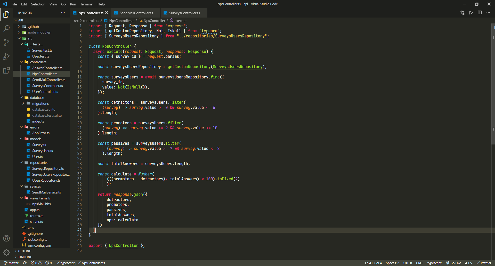

<h1 align="center">NextLevelWeek #04 - Net Promoter Score (NPS)</h1>

<p align="center">
  <a href="#information_source-technologies">Technologies</a>&nbsp;&nbsp;&nbsp;|&nbsp;&nbsp;&nbsp;
  <a href="#-project">Project</a>&nbsp;&nbsp;&nbsp;|&nbsp;&nbsp;&nbsp;
  <a href="#-diagram">Diagram</a>&nbsp;&nbsp;&nbsp;|&nbsp;&nbsp;&nbsp;
  <a href="#-how-to-execute">How to Execute</a>&nbsp;&nbsp;&nbsp;|&nbsp;&nbsp;&nbsp;
  <a href="#-license">License</a>
</p>

<p align="center">
  

 
</p>

<br>

<p align="center">
  
</p>

## :information_source: Technologies

This project was developed utilizing the following technologies:

- [TypeScript](https://www.typescriptlang.org/)
- [Ethereal-Email](https://ethereal.email/)
- [TypeORM](https://typeorm.io/#/)
- [Express](https://expressjs.com/pt-br/)
- [Jest](https://jestjs.io/)
- [SQL Editor Beekeeper Studio](https://www.beekeeperstudio.io/)

## 💻 Project

The NLW NPS is an application that aims to calculate the company's Net Promoter Score. It's possible to register users, register surveys, sending e-mail for users to answer the satisfaction surveys and use this information to calculate the company's NPS.

This project was developed during the 4th edition of the NextLevelWeek, on the NodeJS track. During the event it was possible to learn what an API is, how to start a project utilizing Typescript and Express for route management, TypeORM for data manipulation, automated tests and sending e-mails.

## 🔶 Diagram


## 🚀 How to Execute
```bash
# Clone this repository
$ git clone https://github.com/danielderre/Nlw-04-NPS.git

# Access the repository on your terminal
$ cd Nlw-04-NPS

# Install dependencies
$ yarn install

# Run
$ yarn dev
```

The application can be accessed at [`localhost:3333`](http://localhost:3333).

## 📄 License

This project is under the MIT license. See the [LICENSE](LICENSE.md) for more information.

---
<h4 align="center">
    Developed by Daniel Fernandes Derré Torres | <a href="https://www.linkedin.com/in/danielderre/" target="linkedin.com/in/danielderre">Contact me!</a>
</h4>
